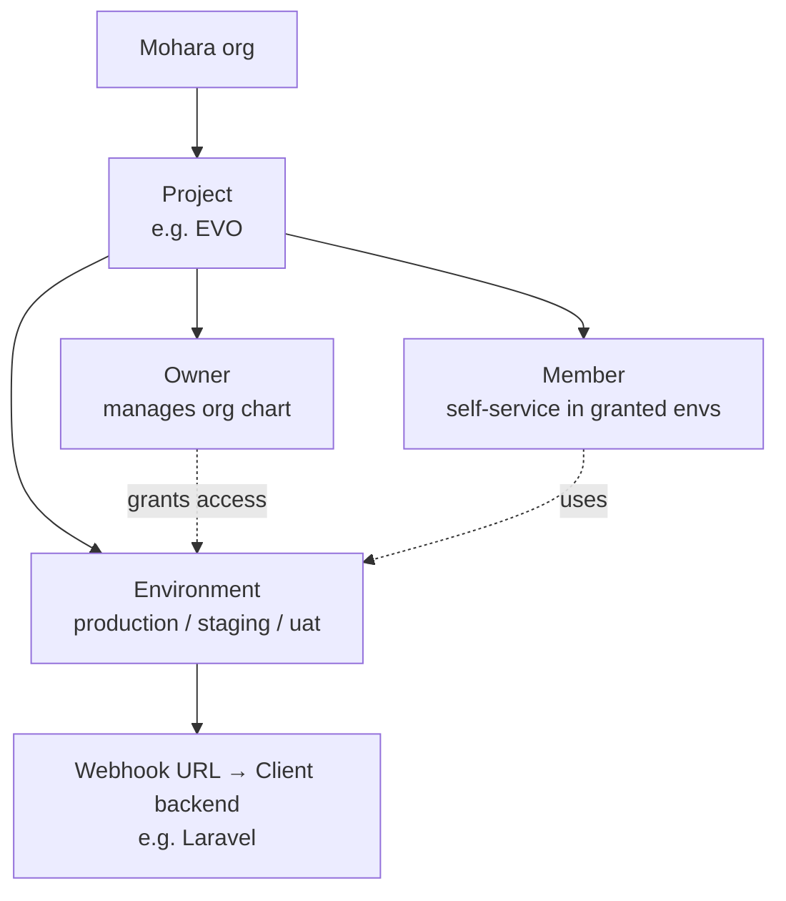
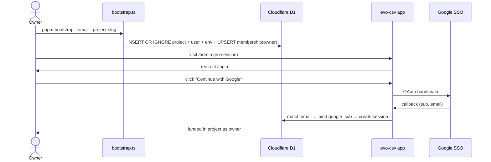
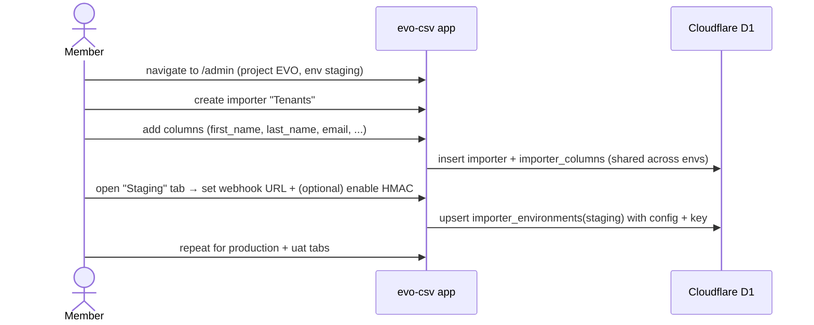
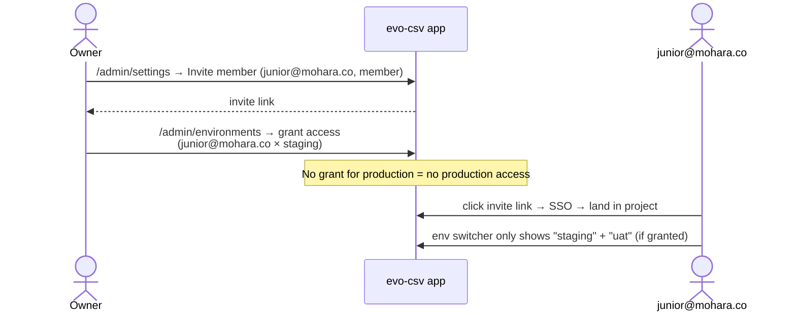
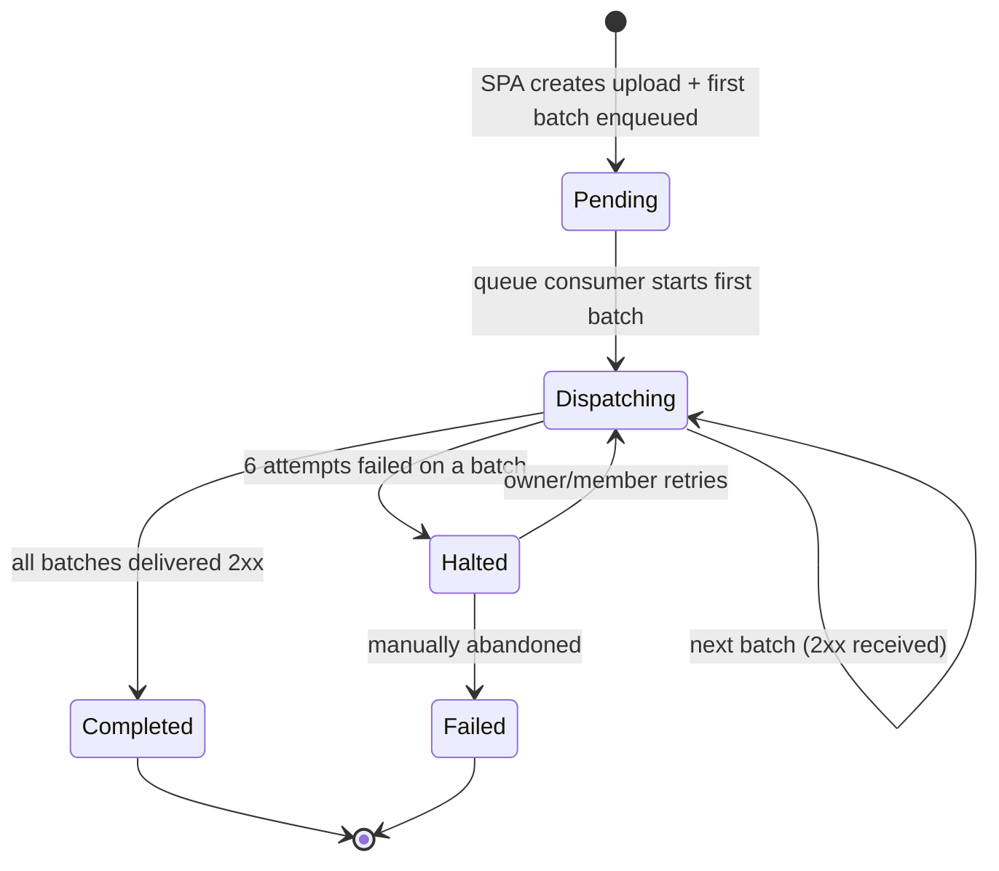
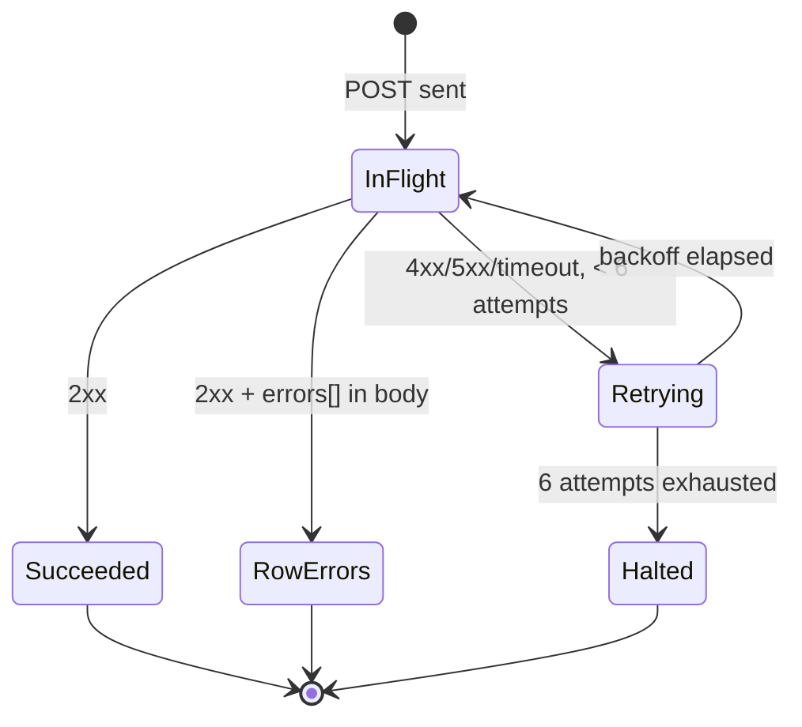
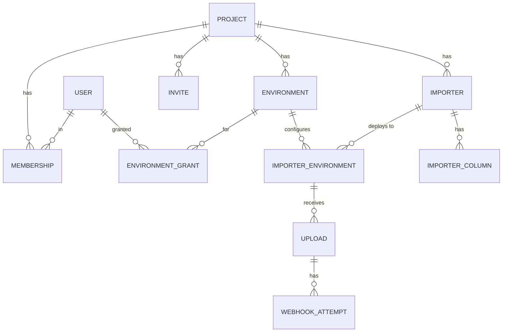

# Product PRD — evo-csv

**Trigger:** Use this when starting a new product, onboarding new team members, or aligning stakeholders on the big picture.
**Output:** A shared mental model — not a ticket list.

**ID:** PRD-001
**Type:** High-Level
**Author:** Aphisak Naksomboon
**Date:** 2026-05-26
**Status:** Draft — Pending Review
**Target release:** Q3 2026 (TBC)
**Version:** 1.0

## Changelog
| Version | Date | Author | Changes |
|---|---|---|---|
| 1.0 | 2026-05-26 | Aphisak Naksomboon | Initial draft |

---

## 1. Overview

**evo-csv** is a self-hosted, internal CSV importer tool for the Mohara dev team. It replaces our current reliance on usecsv.com (a third-party SaaS) for ingesting Property and Tenant data into the EVO platform on behalf of clients. The tool exposes one auth-gated frontend where a dev team member can upload a client-supplied CSV, map columns to a predefined schema, preview/edit, and dispatch the parsed rows to the EVO Laravel backend via the same webhook contract usecsv.com produces — keeping Laravel's existing webhook handlers completely backward-compatible. It is built on a Cloudflare-native edge stack (React + Vite + Hono + Workers/D1/R2/Queues) and is multi-tenant and multi-environment from day 1 so the same tool can later serve other Mohara products and route uploads to the right backend per environment.

## 2. Problem Statement

The Mohara dev team currently uses **usecsv.com** to onboard client data into EVO. This works but creates real friction:

- **Vendor lock-in and recurring SaaS cost** for a workflow we now understand well enough to own.
- **Plaintext webhook secret in the `webhook-secret` header** — usecsv's auth model exposes our shared secret on every dispatch with no rotation strategy beyond "regenerate and re-deploy."
- **Account-wide secret** rather than per-environment — a leak in staging compromises production.
- **One global usecsv project** for everything — no per-environment routing (prod/staging/UAT all share configuration), no per-environment permission boundary, no concept of "junior dev limited to staging."
- **No audit trail** linking an upload to the Mohara dev team member who ran it or the support ticket it was for.
- **Operational coupling** to a third-party service that can go down, rate-limit us, or change its API.

The pain affects the Mohara dev team (operationally), the EVO security posture (secret exposure, no env isolation), and stakeholders (no audit trail when things go wrong).

## 3. Business Model

**Model type:** Internal tool (B2B — single Mohara org owning multiple Mohara products and clients per product).

**Role hierarchy:**



A **Project** maps to a Mohara product (EVO today; other products tomorrow). Within a project, **environments** isolate per-deployment configuration (different webhook URLs, different secrets). **Owners** manage who has access to which environments; **members** can do anything functional inside the environments they're granted access to. End-clients of EVO are not users of evo-csv — their data flows through the tool, not their hands.

## 4. Business Goals

- **Eliminate the usecsv.com subscription line item** in EVO's operating costs by Q3 2026.
- **Improve webhook security posture** — replace plaintext bearer tokens with optional per-importer-environment HMAC signing.
- **Reduce time-to-import** for client onboarding by giving the dev team better column-match heuristics, inline cell editing, and an audit trail (target: a junior dev should be able to run their first end-to-end import in under 10 minutes).
- **Make the tool reusable** across Mohara products — adding a second product (after EVO) should require zero code changes, only new projects + environments.

## 5. Success Metrics

| Metric | Current (usecsv) | Target (evo-csv) |
|---|---|---|
| Time from CSV in hand → all rows in EVO DB (median, 1k rows) | ~12 min (manual usecsv UI) | ≤ 6 min |
| Failed uploads per quarter due to vendor issues | 2–4 | 0 |
| Webhook secret rotations per year | 0 (account-wide, painful) | 4+ (per-env, painless) |
| Per-upload audit coverage (who ran it, for which client, for which ticket) | 0% | 100% |
| Time for a new dev to run their first import | TBC (no formal onboarding today) | ≤ 10 min |
| Cost per month | usecsv subscription | Cloudflare free/usage tier only |

## 6. User Roles & Permissions

| Role | Description | Key goal |
|---|---|---|
| **Owner** | Manages a project's org chart — invites members, creates/deletes environments, grants per-env access, sets allowed Google Workspace domain | Keep access scoped correctly; not in the weeds of running imports |
| **Member** | Trusted dev team. Has access to one or more environments and full self-service within them | Run a CSV import for a client quickly and correctly |

There is no "viewer" tier in MVP — env access is binary. Owners implicitly have access to every environment.

**Permissions matrix:**

| Action | Member w/o env access | Member w/ env access | Owner |
|---|:-:|:-:|:-:|
| See importer list + history in env | — | ✅ | ✅ |
| Run a CSV upload in env | — | ✅ | ✅ |
| Retry a failed batch | — | ✅ | ✅ |
| Create / edit / archive importers | — | ✅ | ✅ |
| Edit importer column schema | — | ✅ | ✅ |
| Set webhook URL / signing per env | — | ✅ | ✅ |
| Rotate webhook secret in env | — | ✅ | ✅ |
| Create / delete environments | — | — | ✅ |
| Invite or remove project members | — | — | ✅ |
| Grant or revoke env access | — | — | ✅ |
| Configure project (name, allowed domain) | — | — | ✅ |

## 7. Core User Journeys

### 7.1 Bootstrap & first sign-in

The first owner is seeded by a CLI command, then signs in via Google SSO and is dropped into the project as owner.



### 7.2 Configure an importer

An owner or member sets up a "Tenants" importer once with the column schema, then configures each environment's webhook URL.



### 7.3 Run a CSV import

The day-to-day flow — a dev gets a client CSV by email/Slack, runs it through evo-csv, and lands rows in Laravel.

```mermaid
sequenceDiagram
    actor Dev as Mohara dev
    participant SPA as evo-csv SPA
    participant API as Hono API
    participant R2 as Cloudflare R2
    participant Queue as CF Queue
    participant Laravel as evo-laravel-server

    Dev->>SPA: open /admin/importers/tenants/upload (staging selected)
    Dev->>SPA: fill upload context (ticket ref, client note)
    Dev->>SPA: drop CSV file
    SPA->>SPA: parse client-side (PapaParse/SheetJS)
    SPA->>SPA: fuzzy auto-match columns; user adjusts
    SPA->>SPA: validate + show per-cell errors; user edits inline
    Dev->>SPA: click "Submit"
    SPA->>API: POST /api/uploads (total_rows, batch_count, ctx)
    SPA->>API: POST /api/uploads/:id/batches/:idx × N
    API->>R2: store source.csv + per-batch JSON
    API->>Queue: enqueue WebhookDispatchJob × N
    loop in batch.index order
        Queue->>Laravel: POST webhook payload (signed if enabled)
        Laravel-->>Queue: 200 {errors: []}
    end
    API-->>SPA: status polling shows completed
    SPA-->>Dev: success summary + per-row errors from Laravel
```

### 7.4 Restrict a junior dev to staging only

An owner grants new team members env access selectively.



## 8. Solution Overview

Six capabilities at the product level (not implementation detail):

1. **Hosted importer configuration** — a single auth-gated web app where the dev team defines importer schemas (columns, validation, examples) once per project.
2. **Per-environment delivery configuration** — each importer can be wired to a different webhook URL, batch size, and security config per environment (prod/staging/UAT), so promoting an upload between environments is a one-click change of the active env, not a re-config.
3. **Five-step upload wizard** — context form → file pick → column match → review/edit → submit + progress. Client-side CSV/XLSX parsing keeps PII off our servers until validation passes.
4. **Backward-compatible webhook delivery** — produces the byte-identical payload that EVO's Laravel webhook handlers already accept, so the cutover requires zero Laravel changes.
5. **Two-layer permissions** — project-level owner vs member, plus per-environment access grants. Owners manage the org chart; members are trusted within their granted envs.
6. **Closed Google SSO + CLI bootstrap** — only invited or pre-seeded users can sign in. No anonymous public surface, no open-signup hole.

## 9. Business Rules

- **One project per Mohara product.** Tenants are not clients — they're products. EVO is one project; future Mohara products can be added without code changes.
- **MVP launches with EVO as the only project.** The project switcher UI is hidden until a second project exists; the data model is multi-tenant from day 1 so adding a second project is a data operation, not a code change.
- **Importer column schemas are project-level (shared across environments).** A member with access to any environment of an importer can edit the schema, which affects every environment. This is intentional — schemas are a project-level decision and the team is trusted within their granted envs.
- **Environment configuration is per-(importer × environment).** Webhook URL, signing toggle, secret, batch size, filter flags are owned by each environment independently.
- **Webhook payload contract is invariant.** We do not add, remove, or rename top-level fields relative to what usecsv.com produces, because EVO's Laravel handlers depend on the existing shape. New auth headers may be added.
- **`batch.index` is 1-based; final batch satisfies `batch.index === batch.count`.** Laravel's `TenantsImport` final-batch logic depends on this equality.
- **Closed SSO signup.** A Google SSO callback for an unknown email + no pending invite returns 403 and creates no user record.
- **Webhook signing is optional per-importer-environment, off by default.** Existing Laravel webhook handlers keep working without modification.
- **`allowed_email_domain` (optional per project)** restricts SSO sign-in to a Google Workspace domain. Invites against non-matching domains are blocked while the restriction is active.
- **Bootstrap is idempotent.** Re-running `pnpm bootstrap` against an existing project slug upserts the membership role to `owner` rather than failing or duplicating.

## 10. Status Flows

### 10.1 Upload status flow



### 10.2 Webhook attempt status flow



Single-platform (web only); no cross-platform status mapping table.

## 11. Design

### Web admin

Top-nav: `[Environment ▾] [user avatar]` for MVP (project switcher chrome is hidden while only one project exists — it reappears automatically when a second project is added).

Sidebar:

- **Importers** (default) — list of importers in the selected env, with "+ New importer"
- **Environments** — owner-only env CRUD
- **API Keys** — per-importer-env secrets + rotate
- **Settings** — project name, allowed_email_domain, members, env_grants
- **Profile**

Each importer detail page is a tabbed editor: `General · Columns · Production · Staging · UAT`, where the env tabs hold per-env webhook URL, signing toggle, secret, batch_size, filter flags, internal key, "Run upload" CTA, and per-env imports history.

The upload wizard (`/admin/importers/:id/upload`) is a 5-step flow: **Upload context → Upload file → Match columns → Review & edit → Submit & progress**.

### Mobile app

Not in scope. This is a desktop-first internal tool; the review grid requires real estate.

**Figma:** TBC (not designed yet; layout will mirror usecsv's admin where it makes sense — see [usecsv-screenshots/](../usecsv-screenshots/) for visual reference)

## 12. Macro Data Model



- **Project** — top-level tenant (e.g. "EVO"). Owns environments, importers, members, invites.
- **Environment** — a project's deployment slot (production, staging, uat, …) with its own webhook config per importer.
- **User** — a Google-authenticated Mohara teammate. One `google_sub` per user.
- **Membership** — links a user to a project with a baseline role (`owner` or `member`).
- **Environment grant** — presence-only allowlist row that gives a member access to one specific environment in a project.
- **Invite** — pending email-keyed grant materialized into a membership when the invitee first signs in.
- **Importer** — a named CSV schema definition (e.g. "Tenants"). Holds the shared column list.
- **Importer column** — one column in an importer's schema (machine name, display name, validation format, required flag, etc.). The `name` field is load-bearing — it's the JSON key in the webhook payload.
- **Importer environment** — per-(importer × environment) config: public key (UUID), webhook URL, signing on/off, secret, batch size, filter flags.
- **Upload** — one run of the wizard. Holds the source file pointer, parsed metadata, total_rows, batch_count, status, and a snapshot of the matched columns map.
- **Webhook attempt** — one attempt to dispatch one batch. Records HTTP status, response body, parsed errors, attempt number.

Plus a small `sequences` table for generating the integer `uploadId` value that goes on the webhook payload (Laravel validates it as integer).

## 13. Integration Points

- **Google OAuth / Google Workspace** — authentication (Auth Code + PKCE flow via `@hono/oauth-providers/google`). Optional `hd=mohara.co` domain hint per project.
- **EVO Laravel server** (`evo-laravel-server`) — webhook receiver. Existing endpoints `/webhook/property/import` and `/webhook/tenants/import` consume the payload byte-identically. No code changes required for MVP; the optional HMAC verify middleware is a separate later PR.
- **Cloudflare platform** — Workers (runtime), D1 (relational data), R2 (file storage), KV (sessions + hot key lookups), Queues (sequential webhook dispatch with retries). All in one CF account. MVP hostname is the free `*.workers.dev` subdomain (e.g. `evo-csv.<account>.workers.dev`); a custom domain is a post-MVP DNS swap with no code change.
- **MailChannels via Cloudflare Email Routing** — outbound transactional email for invites (future; not MVP).
- **Future** — other Mohara product backends as additional environments per future projects.

## 14. Non-Functional Requirements

- **Scale (MVP):** ≤ 50,000 rows per upload (client-side parsing limit); ≤ 200 uploads per project per month (well within Cloudflare free tier); ≤ 50 concurrent users (no concurrency story needed at this scale).
- **Performance:** Worker cold start ≤ 50 ms; importer page render ≤ 1 s; upload wizard step transitions ≤ 200 ms; webhook batch dispatch ≤ 10 min timeout per usecsv parity.
- **Security:**
  - Closed SSO (no open signup)
  - Per-importer-environment HMAC-SHA256 signing with 5-minute timestamp window (opt-in)
  - Per-project Google Workspace domain enforcement (`hd` hint + post-callback verification)
  - IDOR-resistant repo layer (project/env IDs sourced only from session context, never from body)
  - File retention: 30 days, then auto-purged from R2
- **Availability:** Inherits Cloudflare's edge availability (>99.99% historical). No backups for MVP — D1 is single-region; if data is lost, re-bootstrap and re-configure importers. Acceptable because the data is configuration + audit logs, not source-of-truth client data.
- **Audit:** Every upload records who initiated it (user_payload auto-fills with member email), what ticket it was for (free-text metadata), which env it ran against, every batch attempt with response code + body excerpt.
- **Compliance:** No PII storage beyond 30 days. No GDPR Data Processor role — client PII flows through to EVO Laravel and is deleted from R2 after the retention window.

## 15. Scope

### In scope

- Single Cloudflare Worker hosting React SPA + Hono API, deployed at `*.workers.dev` (no custom domain for MVP)
- Google SSO authentication, closed signup, CLI bootstrap
- **Single project (EVO) at launch.** Multi-tenant data model from day 1; project switcher chrome hidden in the UI until a second project exists
- Multi-environment from day 1 (production / staging / uat)
- Two-role permission model (owner / member) + per-env allowlist grants
- Importer configuration: columns, validation formats matching usecsv's 8 types, per-env delivery config
- 5-step upload wizard (context → upload → match → review → submit)
- Backward-compatible webhook delivery to EVO Laravel (no Laravel changes required)
- Optional per-importer-environment HMAC webhook signing
- Snapshot test pinning the webhook payload format against the existing Laravel fixtures + the empirically captured live usecsv payload
- Tenants and Properties importers seeded by `tools/seed-evo-importers.ts`

### Out of scope

- Anonymous public upload URLs (no `/i/<key>` flow)
- Client-facing self-service portal
- Multiple projects at launch (multi-tenant data model is ready, UI is stubbed)
- JS/React SDK packages (`@evo/csv-js`, `@evo/csv-react`)
- `onData` browser-callback delivery mode
- Validation hooks (`onRecordsInitial`, `onRecordEdit`)
- Languages other than English
- Themes / branding customisation
- Magic-link or email/password auth (Google SSO only)
- Markdown welcome messages
- Excel formula evaluation
- File retention beyond 30 days
- Per-importer rate limiting
- Streaming/web-worker CSV parse for > 50k rows
- GitHub Actions CI/CD (manual `pnpm deploy` for MVP)
- Custom domain (defer; MVP runs on `*.workers.dev`)
- Mobile app

## 16. Dependencies

- **EVO Laravel server** — for end-to-end testing the webhook contract; no code change required for MVP, but a local instance (or cloudflared tunnel to staging) needs to be reachable during development.
- **Cloudflare account access** — Worker, D1, R2, KV, Queues bindings need to be provisioned in the existing Mohara Cloudflare account (or a new one if separation is preferred).
- **Google Cloud OAuth client** — credentials (`GOOGLE_OAUTH_CLIENT_ID`, `GOOGLE_OAUTH_CLIENT_SECRET`) need to be issued and stored as Wrangler secrets. The OAuth redirect URI must be set to `https://evo-csv.<account>.workers.dev/api/auth/google/callback` for MVP.
- **No other PRDs** — this is PRD-001.

## 17. Risks

| Risk | Likelihood | Impact | Mitigation |
|---|---|---|---|
| Subtle webhook-payload drift breaks Laravel's tenant import | Low | High | Snapshot test pinned to both existing Laravel fixtures + captured live usecsv payload; CI blocks deploy on diff |
| D1 schema migration mid-import corrupts an in-flight upload | Low | Medium | Migrations applied with no in-flight uploads (low traffic); upload state in D1 + R2 means partial uploads can be replayed |
| Cloudflare Queue ordering not preserved → batches arrive out of order at Laravel | Low | High | Single-consumer queue per upload; explicitly assert `batch.index` order in the consumer and refuse to dispatch out of order |
| `importer_columns.name` drifts from Laravel's expected PHP keys | Medium | High | The spec lists the exact PHP keys for both Tenants and Properties; seed tool covered by an assertion test |
| Junior dev edits column schema in staging and breaks production | Medium | Medium | Schema is project-level; documented as the "trust the team" tradeoff; can lock down to owner-only if it becomes a real problem |
| Cloudflare D1 size or query limits hit at unexpected scale | Low | Low | MVP scale is tiny (≤200 uploads/month); revisit if Mohara onboards multiple products that share this tool |
| usecsv changes its UI/contract while we're building and we lose our reference | Low | Low | Captured live payload (2026-05-26) is committed to the repo as a frozen reference |
| Closed-signup gate has a bug that lets unknown users in | Medium | High | Verification test asserts the "no match, no invite → 403, no users row" branch explicitly; multi-tenant isolation test forges project IDs |
| Bootstrap CLI accidentally promotes a non-Mohara email to owner | Low | High | Bootstrap is a deliberate operator action; `allowed_email_domain` can be set during bootstrap to lock subsequent invites |

## 18. Open Questions

- **Should we add an `X-Evo-Environment` header to the webhook payload** for projects that want a single backend to receive all envs? Trivial to add later; not needed for EVO.
- **Magic-link auth for non-Google users** — needed for any external contractors / partners who might log in? Currently scoped out.
- **Properties importer column completeness** — the Laravel `PropertiesImport` accesses 13 row keys; do we seed all of them or only the most common subset? Likely all, but worth confirming with the team running real imports.
- **Cloudflare account separation** — do we want evo-csv in a dedicated CF account for blast-radius isolation, or co-located with other Mohara properties?

**Resolved during PRD review (2026-05-26):**

- ~~Multiple projects on day 1, or just EVO?~~ → **Just EVO.** Multi-tenant data model stays; project switcher UI hidden until a second project exists.
- ~~Domain choice?~~ → **`*.workers.dev` for MVP.** Custom domain is a post-MVP DNS swap.

## 19. Glossary

| Term | Definition |
|---|---|
| **Project** | Top-level tenant in evo-csv. One per Mohara product. EVO is project #1. |
| **Environment** | A deployment slot within a project (e.g. production, staging, uat) with its own webhook config per importer. |
| **Importer** | A named CSV schema definition (e.g. "Tenants", "Properties") with a list of expected columns. Schema is shared across environments. |
| **Importer environment** | The per-(importer × environment) row holding the public key, webhook URL, signing toggle/secret, and other delivery config. The thing that has a unique `key` UUID. |
| **Owner** | Project role that manages the org chart (members, invites, environments, env_grants). |
| **Member** | Project role with full self-service inside environments they're granted access to. |
| **Env grant** | Presence-only row (project_id, user_id, environment_id) giving a member access to one environment. |
| **Upload** | One run of the upload wizard — one file, multiple batches. |
| **Batch** | A chunk of rows (default 1,000) dispatched as a single webhook POST. `batch.index` is 1-based; final batch is `index === count`. |
| **Webhook attempt** | One delivery attempt of one batch. Retries create new attempt rows. |
| **Bootstrap** | One-shot CLI command (`tools/bootstrap.ts`) that seeds the first owner + project + default environment. Idempotent on `(project.slug, user.email)`. |
| **Closed SSO** | Sign-in policy where unknown emails without a pending invite are rejected (no auto-account-creation). |
| **`webhook-secret` header** | The plaintext bearer-token-style header usecsv.com sends today. Replaced in evo-csv by optional HMAC signing per-importer-environment. |
| **EVO** | Mohara's property-management platform (`evo-laravel-server`); the first project this tool serves. |
